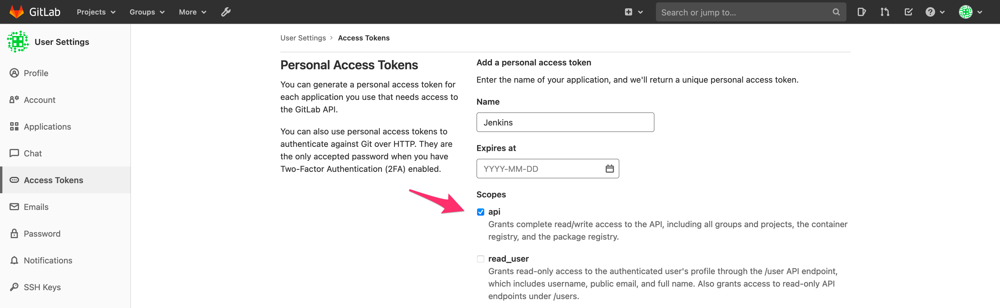
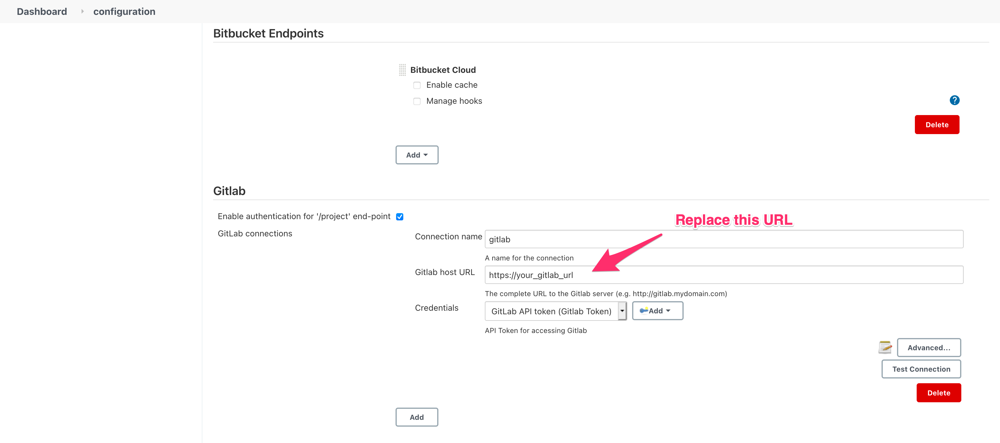
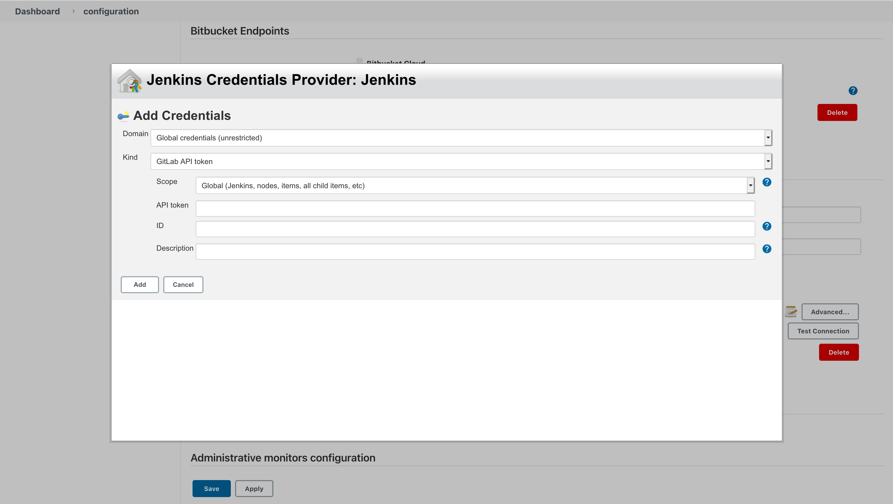
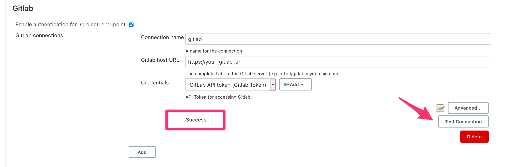

### Configure Jenkins with Gitlab

> Jenkins is an open-source automation server to manage and control software delivery processes throughout the entire software development lifecycle, including build, test deployment, and much more. It's similar to Gitlab CI/CD but doesn't use YAML syntax.

Before we start with Jenkins, we need to configure it as the default CI/CD system for Gitlab. 

We can do it in **two** steps

#### Step 1

Create a personal access token by visiting https://your_gitlab_url/-/profile/personal_access_tokens. We will use this token in the next step. 

Use `Jenkins` as the Name of the token. Ensure you check the **api** checkbox under the **scopes** and click on the **Create personal access token** button to generate the token.

> Please save the generated token somewhere in a file, as it won't be shown again after this step.

#### Step 2

Log in to the Jenkins system and configure Jenkins to authorize the connection with the Gitlab machine by visiting https://your_jenkins_url/configure

Scroll down till you find the **Gitlab** section 

fill the form with the following details.

**Connection name**: `gitlab-server`

**Gitlab host URL**: `https://your_gitlab_url`

To configure the **Credentials** field, we need to perform the following steps. 

Click the **Add** button (it has a key symbol), then select **Jenkins** a form will appear with a title **Jenkins Credentials Provider: Jenkins**. Choose **Gitlab API token** from the **Kind** dropdown and add the following values into it:

**Scope**: No change (leave it as is)

**API token**: Enter the personal access token we created in the **step 1**.

**ID**: `gitlab-api-token`

**Description**: leave it blank, as it's optional 

Click on the **Add** button and select the **gitlab-api-token** credentials from the Credentials dropdown. 

Once done, we will test the connection to ensure everything is working fine by clicking the **Test Connection** button. If everything is set up correctly, you should see a **Success** message. 

Finally, click on the **Save** button at the bottom of the page.

We configured the Gitlab connection details in the Jenkins system. 